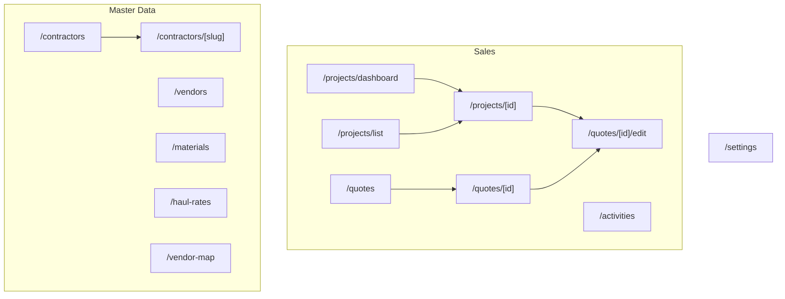
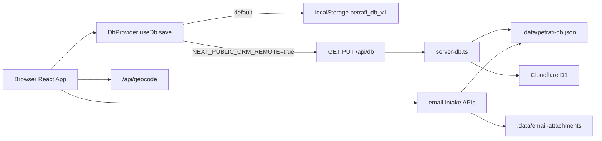
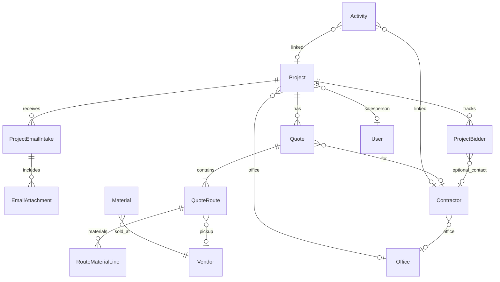
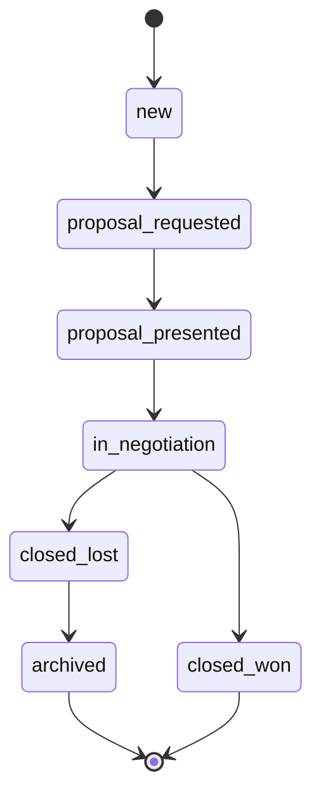
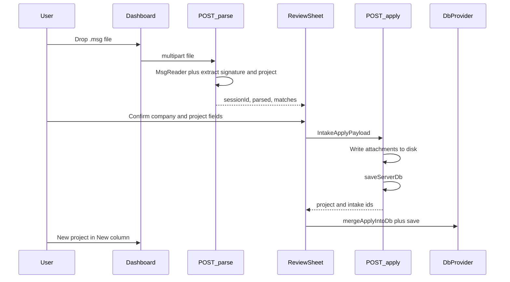
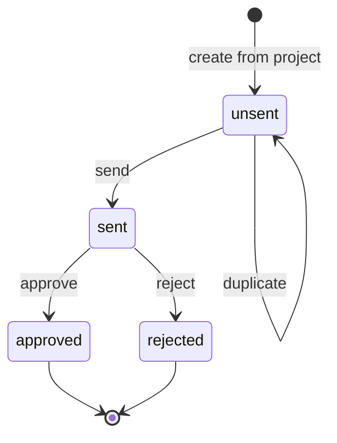
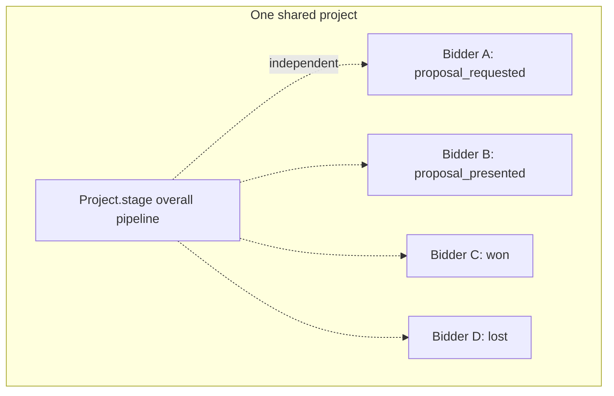
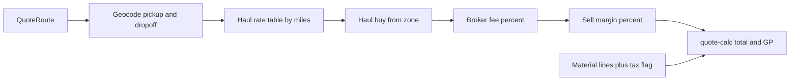

# Petrafi — Product Requirements Document

> Trucking Sales & CRM for Allied Trucking (ATPB). This document describes everything built in the app to date, the data model, key workflows, and the parts that are intentionally out of scope. It is meant as a shared reference for developers joining or contributing to the project.

Last reviewed against the codebase on Jun 4, 2026.

---

## 1. Product overview

Petrafi is an internal sales and CRM tool for a construction-material hauling business. Sales staff manage a pipeline of bidding opportunities ("projects"), build quotes that combine hauling and material costs, and keep track of the contractors, quarries, and disposal sites they work with.

- **Purpose:** Manage construction-material hauling sales end to end — projects, multi-contractor bidding, quotes (haul plus material pricing), vendors and quarries, a contractor CRM, and bid-email intake from Outlook `.msg` files.
- **Stack:** Next.js 16 (runs on port 3002), React 19, Tailwind CSS with shadcn UI components, Leaflet for maps, and optional Cloudflare D1 persistence via OpenNext.
- **Current maturity:** Functional internal tool. Most modules are complete; the **Orders** tab on the project detail page is a placeholder, and authentication is a simple user picker rather than a real login.

### How to run

```bash
npm install
npm run dev
```

Open [http://localhost:3002](http://localhost:3002). Data is stored in browser localStorage by default (the app shows a yellow "local only" banner). See [section 9](#9-storage-migrations-and-ops) for remote storage.

---

## 2. Users and roles

The app supports a lightweight role model defined in [`src/lib/types.ts`](../src/lib/types.ts).

- **Salesperson** — sees a "My projects" filter, has an assigned office, and creates quotes and activities.
- **Admin** — full visibility across offices, plus settings and data imports.
- **Offices** — ATPB, ATF, ATWC, ATO, and ATCF. Each project, contractor, and user can be assigned to an office.

There is no password login today. The "current user" is selected in Settings and stored in the browser; see [`src/lib/current-user.ts`](../src/lib/current-user.ts).

---

## 3. Information architecture

The sidebar groups pages into Sales and Master Data, with Settings in the footer.



### Route reference

| Route | Purpose | Key file |
|-------|---------|----------|
| `/` | Redirects to `/projects` | [`src/app/page.tsx`](../src/app/page.tsx) |
| `/projects` | Redirects to dashboard | [`src/app/projects/page.tsx`](../src/app/projects/page.tsx) |
| `/projects/dashboard` | CRM Kanban board: stages, drag-and-drop, filters, archived view, email `.msg` drop, new project | [`src/app/projects/dashboard/page.tsx`](../src/app/projects/dashboard/page.tsx) |
| `/projects/list` | Table of all projects with stage labels | [`src/app/projects/list/page.tsx`](../src/app/projects/list/page.tsx) |
| `/projects/[id]` | Project detail: stage/office/salesperson controls, bidding companies panel, tabs (Quotes, Activities, Email, Orders) | [`src/app/projects/[id]/page.tsx`](../src/app/projects/[id]/page.tsx) |
| `/quotes` | Global quote list with search and create | [`src/app/quotes/page.tsx`](../src/app/quotes/page.tsx) |
| `/quotes/[id]` | Read-only quote view: totals, gross profit breakdown, lifecycle actions, history, activities | [`src/app/quotes/[id]/page.tsx`](../src/app/quotes/[id]/page.tsx) |
| `/quotes/[id]/edit` | Quote editor: routes, haul/material lines, vendor map, calc haul | [`src/app/quotes/[id]/edit/page.tsx`](../src/app/quotes/[id]/edit/page.tsx) |
| `/activities` | Calls, meetings, and jobsite visits; schedule and complete | [`src/app/activities/page.tsx`](../src/app/activities/page.tsx) |
| `/contractors` | Company-grouped contractor CRM | [`src/app/contractors/page.tsx`](../src/app/contractors/page.tsx) |
| `/contractors/[companySlug]` | Company detail: contacts, projects, quotes, activities, rename | [`src/app/contractors/[companySlug]/page.tsx`](../src/app/contractors/[companySlug]/page.tsx) |
| `/vendors` | Quarries and disposal sites; geocode single or batch | [`src/app/vendors/page.tsx`](../src/app/vendors/page.tsx) |
| `/vendors/[id]` | Vendor detail and materials at the site | [`src/app/vendors/[id]/page.tsx`](../src/app/vendors/[id]/page.tsx) |
| `/materials` | Material catalog with price and unit | [`src/app/materials/page.tsx`](../src/app/materials/page.tsx) |
| `/haul-rates` | Per-mile haul rate table with inline edit and bulk adjust | [`src/app/haul-rates/page.tsx`](../src/app/haul-rates/page.tsx) |
| `/vendor-map` | Full-screen Leaflet map for vendors and route building | [`src/app/vendor-map/page.tsx`](../src/app/vendor-map/page.tsx) |
| `/settings` | Org defaults, storage mode, import helpers, pricing meta | [`src/app/settings/page.tsx`](../src/app/settings/page.tsx) |

---

## 4. System architecture

The browser holds the full database in memory through a React context ([`DbProvider`](../src/components/DbProvider.tsx)). Depending on configuration, that database is persisted either to localStorage or to a server API.



**Key behavior:** Email parse/apply and attachment download always hit the dev server API (Node runtime plus filesystem), even when CRM data otherwise lives in localStorage. After a successful apply, the client merges the server result into its in-memory database via [`mergeApplyIntoDb`](../src/lib/email-intake/apply-intake.ts) and then calls `save()`.

---

## 5. Data model

All collections hang off a single aggregate root, the `Db` interface in [`src/lib/types.ts`](../src/lib/types.ts). The diagram below shows the main relationships.



### Field-level notes

- **`Project`** — `stage` follows the pipeline below; `archived` is set automatically when a project becomes `closed_lost`. Email intake adds `sourceCompany`, `sourceContractorId`, and `intakeDueDate`.
- **`ProjectBidder`** — one row per contractor company bidding on a shared project. Carries its own `status` (`proposal_requested`, `proposal_presented`, `won`, or `lost`), an optional linked `contractorId`, and free-text `notes`. This is independent of the project's overall stage.
- **`Quote`** — uses PRP-style sequential numbers (for example `PRP000000001`), a `status` lifecycle, one or more `QuoteRoute` entries, and a `history` array of lifecycle events. Each route can carry multiple `RouteMaterialLine` items plus a haul leg, and a `taxable` flag.
- **`Material`** — vendor-linked pricing with a `priceUnit` of `TN`, `CY`, `LD`, or `HR`. A material can be carried by multiple quarries via `vendorIds`.
- **`HaulRate`** — a simple `miles` to `ratePerLoad` mapping; legacy zone shapes are normalized on load.
- **`DbMeta`** — global settings: quote counter, default tax rate, haul broker fee percent, haul sell margin percent, org name/code, and the current user id.

---

## 6. Feature requirements (implemented)

| Module | Summary | Primary files |
|--------|---------|---------------|
| Projects pipeline | Kanban CRM, drag to change stage, office/sales filters, archived view | [`projects/dashboard/page.tsx`](../src/app/projects/dashboard/page.tsx), [`lib/projects.ts`](../src/lib/projects.ts) |
| Project detail | Stage/office/salesperson controls, bidding companies, tabs | [`projects/[id]/page.tsx`](../src/app/projects/[id]/page.tsx), [`ProjectBiddersPanel.tsx`](../src/components/projects/ProjectBiddersPanel.tsx) |
| Bidding companies | Multiple contractors per job, each with an independent status | [`lib/project-bidders.ts`](../src/lib/project-bidders.ts) |
| Email intake | Drop a `.msg` file, review parsed fields, apply, view in Email tab | [`EmailIntakeCard.tsx`](../src/components/projects/EmailIntakeCard.tsx), [`lib/email-intake/`](../src/lib/email-intake/) |
| Quotes | Create, edit, and view quotes; calc haul; gross profit; lifecycle | [`quotes/[id]/edit/page.tsx`](../src/app/quotes/[id]/edit/page.tsx), [`lib/quote-calc.ts`](../src/lib/quote-calc.ts) |
| Contractors | Company-grouped CRM, contacts, company rename | [`contractors/page.tsx`](../src/app/contractors/page.tsx), [`lib/contractors.ts`](../src/lib/contractors.ts) |
| Vendors and map | Quarries and disposal sites, geocoding, Leaflet map | [`vendors/page.tsx`](../src/app/vendors/page.tsx), [`VendorMap.tsx`](../src/components/VendorMap.tsx) |
| Materials and haul rates | Material catalog plus per-mile rate table | [`materials/page.tsx`](../src/app/materials/page.tsx), [`haul-rates/page.tsx`](../src/app/haul-rates/page.tsx) |
| Activities | Calls, meetings, and jobsite visits with scheduling | [`activities/page.tsx`](../src/app/activities/page.tsx), [`lib/activities.ts`](../src/lib/activities.ts) |
| Settings and imports | Org defaults and one-click data imports | [`settings/page.tsx`](../src/app/settings/page.tsx), `scripts/import-*.ts` |

### 6.1 Projects pipeline

- **Goal:** Give sales a Kanban view of every active opportunity and let them move work forward by dragging cards.
- **User actions:** Drag a card to change its stage; search by name; filter by office or salesperson; toggle "My projects" and "Show archived"; create a project via the New Project sheet.
- **Behavior:** Stage changes go through [`setProjectStage`](../src/lib/projects.ts); moving a project to `closed_lost` auto-archives it.
- **Acceptance:** A dragged card persists its new stage after reload; archived projects are hidden unless the toggle is on.

### 6.2 Project detail and bidding companies

- **Goal:** Track a single job and the multiple general contractors competing to win it.
- **User actions:** Change stage/office/salesperson; add a bidding company (existing or new), set each company's status, add follow-up notes, remove a company; open the Quotes, Activities, Email, and Orders tabs.
- **Behavior:** The bidders panel ([`ProjectBiddersPanel.tsx`](../src/components/projects/ProjectBiddersPanel.tsx)) reads and writes through [`lib/project-bidders.ts`](../src/lib/project-bidders.ts). If the project came from email intake, its `sourceCompany` is suggested as a one-click add.
- **Acceptance:** Each bidder keeps its own status independent of the project stage; company names link to the matching contractor company page.

### 6.3 Quotes

- **Goal:** Produce accurate quotes that combine hauling (non-taxable) and material (optionally taxable) pricing.
- **User actions:** Create a quote from a project or the quotes list; add routes with pickup/dropoff and a vendor-linked pickup; run "Calc haul"; add multiple material lines per route; send, approve, reject, or duplicate.
- **Behavior:** Numbers are generated by [`generateQuoteNumber`](../src/lib/storage.ts). Pricing math lives in [`lib/quote-calc.ts`](../src/lib/quote-calc.ts); lifecycle actions in [`lib/quote-actions.ts`](../src/lib/quote-actions.ts).
- **Acceptance:** Totals reflect haul plus material, tax applies only to taxable material, and every lifecycle change appends a history event.

### 6.4 Contractors

- **Goal:** Maintain a CRM grouped by company while still tracking individual contacts.
- **User actions:** Browse companies, open a company page, add or edit contacts, rename a company.
- **Behavior:** Grouping and slugs are handled in [`lib/contractors.ts`](../src/lib/contractors.ts). Company project counts include both quotes and bidding-company links.

### 6.5 Vendors, materials, and haul rates

- **Goal:** Keep the pickup/disposal network and pricing inputs current.
- **User actions:** Add quarries/disposal sites, geocode them (single or batch), maintain the material catalog, and edit per-mile haul rates with an optional bulk percentage adjustment.
- **Behavior:** Geocoding calls [`/api/geocode`](../src/app/api/geocode/route.ts) (Nominatim with a US Census fallback). The vendor map uses [`VendorMap.tsx`](../src/components/VendorMap.tsx).

### 6.6 Activities

- **Goal:** Log and schedule outreach against projects, contacts, and companies.
- **User actions:** Create calls, meetings, or jobsite visits; mark them complete.
- **Behavior:** The reusable [`ActivitiesPanel`](../src/components/activities/ActivitiesPanel.tsx) is embedded on project, quote, and company pages.

### 6.7 Settings and imports

- **Goal:** Configure org defaults and load seed data without manual entry.
- **User actions:** Set the current user, org name/code, and quote defaults; load ATPB quarries, contractors, and haul rates from server-side imports.
- **Behavior:** Import scripts write to the server JSON file; Settings buttons hydrate the local database in local mode.

---

## 7. Workflow diagrams

### 7a. Project pipeline stages



### 7b. Email intake (review then apply)



**Parsing rules:**

- The email signature provides the company and contact, but its street address is treated as the contact address, never the jobsite.
- Project name, jobsite address, and due date come from the subject, body, and filename (for example `Oakwood Square Retail (Boynton Beach, FL)` with `Due Jun 12, 2026`).
- For forwarded mail from an internal sender, the parser prefers the external `From:` block embedded in the body.
- Dropping the same file again surfaces existing company/project matches so the user can link instead of duplicating.

### 7c. Quote lifecycle



### 7d. Bidding companies versus project stage



### 7e. Quote pricing flow



**Pricing rules:**

- Hauling is a non-taxable service; tax does not apply to the haul sell.
- Material sell is taxed only when the route is marked taxable.
- The broker fee is a configurable percentage of the haul buy and represents platform income; net buy equals buy minus broker.
- "Calc haul rate" on the quote editor geocodes the pickup and dropoff, finds the mileage zone, fills the buy from the rate table, and applies the margin percentage from Settings.

---

## 8. API reference

| Method | Path | Purpose |
|--------|------|---------|
| GET / PUT | `/api/db` | Load or save the full `Db` (file or D1) |
| POST | `/api/email-intake/parse` | Upload a `.msg` file; returns a session id plus parsed preview and matches |
| POST | `/api/email-intake/apply` | Commit the intake to the database and promote attachments to disk |
| GET | `/api/email-intake/attachments/[id]` | Stream attachment bytes |
| GET | `/api/geocode` | Address to lat/lng (Nominatim with US Census fallback) |

All email-intake routes run with `runtime = "nodejs"` because they touch the filesystem. Server persistence is centralized in [`src/lib/server-db.ts`](../src/lib/server-db.ts) (`loadServerDb` / `saveServerDb`).

---

## 9. Storage, migrations, and ops

| Layer | When | Location |
|-------|------|----------|
| localStorage | Default dev mode (`NEXT_PUBLIC_CRM_REMOTE` unset or false) | Key `petrafi_db_v1` ([`src/lib/storage.ts`](../src/lib/storage.ts)) |
| Server JSON file | `npm run dev` with the API, and all import scripts | `.data/petrafi-db.json` |
| Cloudflare D1 | `preview:cloudflare` or `deploy` with a `DB` binding | Migrations `migrations/0001_init.sql` through `migrations/0011_project_bidders.sql` |
| Email files | Parse/apply only | `.data/email-attachments/` and `.data/email-intake-sessions/` ([`src/lib/email-attachment-storage.ts`](../src/lib/email-attachment-storage.ts)) |

**Migrations of note:** `0009_email_intake.sql`, `0010_project_intake_fields.sql`, and `0011_project_bidders.sql` cover the newest features.

**npm scripts** ([`package.json`](../package.json)):

| Script | Purpose |
|--------|---------|
| `dev` | Dev server on port 3002 |
| `build` / `start` | Production build and serve |
| `build:cloudflare` / `preview:cloudflare` / `deploy` | OpenNext plus Wrangler |
| `d1:create` / `d1:migrate` / `d1:migrate:remote` | D1 setup and migrations |
| `import:atpb` | Load offices, quarries, users, and haul rates from source files |
| `import:contractors` | Replace contractors from the customers workbook |
| `import:haul` | Load only the haul rate table |
| `geocode:vendors` | Batch geocode vendors in the server file |

**Environment variables:** `NEXT_PUBLIC_CRM_REMOTE` (switch to API storage), `ATPB_DATA_DIR`, `ATPB_CUSTOMERS_FILE`, and `HAUL_RATES_FILE` for imports.

---

## 10. UI patterns

Reuse these shared components for consistency:

- **PageActionCards / PageActionCard** — primary call-to-action cards (New Project, Email intake). See [`PageActionCard.tsx`](../src/components/layout/PageActionCard.tsx).
- **CreateFormSheet** — slide-over forms for create/edit flows. See [`CreateFormSheet.tsx`](../src/components/layout/CreateFormSheet.tsx).
- **FormSection / FormField** — grouped form layout.
- **DetailHeader plus Tabs** — used on project and quote detail pages.
- **Kanban cards** — draggable project cards that update stage on drop.
- **Status chips** — consistent styling for quote, bidder, and activity states.

---

## 11. Known limitations and out of scope (v1)

- The **Orders** tab on project detail is a placeholder ("Orders coming soon").
- Email intake supports `.msg` only; `.eml` is not handled yet.
- There is no auto-apply for email intake — the review sheet is always required.
- There is no LLM-based parsing.
- Email intake requires a running dev server because parse/apply use the filesystem.
- Authentication is a current-user picker, not a real login.
- The `d1:migrate:remote` script may lag behind the latest local migrations; verify it before a Cloudflare deploy.

---

## 12. Suggested roadmap

- Build out the Orders module behind the existing tab.
- Add `.eml` intake alongside `.msg`.
- Unify the remote migration script so it always includes the newest migrations.
- Consider syncing localStorage and the server file so email metadata is consistent in local mode.
- Add real authentication and multi-user support.

---

## Sharing tips

- GitHub renders mermaid diagrams in `.md` files natively, so this document displays fully in a pull request or repo view.
- To export a PDF, use the VS Code "Markdown PDF" extension, or paste into Notion or Confluence (those may need a mermaid plugin).
- Recommended onboarding path for a new developer: read the [README](../README.md), then this PRD, then run `npm run dev`.
